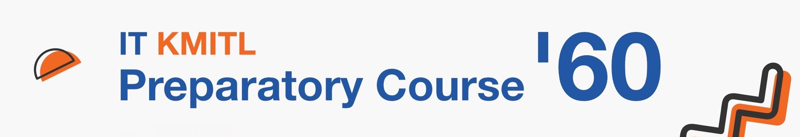

# ITKMITL Pre-Programming Course 2560
สวัสดีครับ พี่ชื่อคุมะมง :bear::black_circle::jp: (หรืออยากเรียกว่าพี่มง ก็ตามสบายจ้า)

เป้าหมายของ Repository นี้คือการให้น้องเรียนรู้ด้วยตนเองนะครับและลองอ่านและทำความเข้าใจโค้ดของเพื่อนๆ หรือ ของพี่มงเอง โดยมีอาจารย์ โชคิพัฒน์ และเพื่อนๆ IT14 หวังว่าน้องจะได้อะไรจากการเรียน Pre Programming นะครับ

> "Python is easy to use, powerful, and versatile, making it a great choice for beginners and experts alike. Python’s readability makes it a great first programming language — it allows you to think like a programmer and not waste time understanding the mysterious syntax that other programming languages can require. " -- Code School

พี่จึงหวังว่า การที่พี่ทำให้น้องมากขนาดนี้ น้องจะอยากขนขวาย และเข้าใจความ Python ได้อย่างลึกซื้งมากขื้น เพื่อคะแนน PSIT ที่ดี และดีอย่างยั่งยืน ไม่อ่อนและตายจากพี่ๆไปซะก่อนนะจ๊ะ ดังนั้น พี่ขอปล่อยให้น้องเข้ามาดู Repository ได้เรื่อยๆนะจ๊ะ อิอิ

#  Table of Content

> **Note** 
> พี่ได้ทำการย้ายไฟล์การเรียนภาษา Python ไว้ที่ [https://prepro.sagelga.com/](https://prepro.sagelga.com/) โดยพี่ก็จะทำการอัพเดทเนื้อหาเกี่่ยวกับ Python ให้อย่างต่อเนื่อง

ส่วนไฟล์อื่น ๆ ยังถูกเก็บไว้ในโฟล์เดอร์ `docs`

#  Resource

Think Python 2 (หนังสือที่สามารถเอาเข้าห้องสอบได้)  http://greenteapress.com/thinkpython2/thinkpython2.pdf

Python Tutor (Python Debugger) 
http://www.pythontutor.com

Python Organizations (Document หลักของ Python) 
https://docs.python.org/3/

Python3 on CodeAcademy (เรียน Python3 ตั้งแต่เรื่มต้น) 
https://www.codecademy.com/learn/learn-python

Learn Command Line on CodeAcademy 
https://www.codecademy.com/learn/learn-the-command-line

Learn Git on CodeAcademy 
https://www.codecademy.com/learn/learn-git

#  Contribute
สำหรับน้องๆที่ต้องการช่วยพัฒนา Repository นี้ก็สามารถทำได้โดยการ
1. กดปุ่ม [Fork](https://github.com/sagelga/PreProgramming-60#fork-destination-box) เพื่อให้ repo นี้เป็นของน้องเอง
2. ทำการแก้ไขไฟล์ที่ต้องการใน Repository ที่ fork มา
3. หากแก้เรียบร้อยแล้ว ให้กด [Pull Requests](https://github.com/sagelga/PreProgramming-60/compare) โดยให้ base เป็น sagelga/master และ compare กับ branch ของน้อง
4. กด create แล้วส่ง request มา
5. พี่คุมะมงจะไปดูโค้ดของน้อง และก็จะดึงมาอยู่ใน Repository นี้

# Have fun coding!!!
Follow me on GitHub at [https://github.com/sagelga](https://github.com/sagelga)

Copyright by P' Kumamon IT14.  
For education purpose only.

